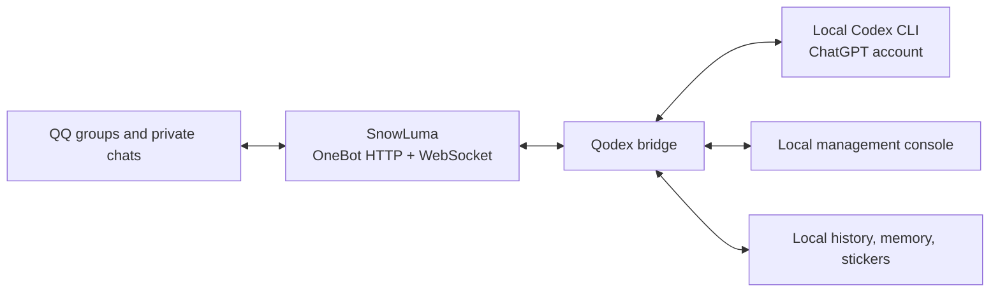

# Qodex

Qodex is a local Windows bridge that connects QQ group and private messages through SnowLuma to Codex. For each allowed conversation, the model decides whether to reply, stay silent, search the web, or interpret an image. Administrators manage access, style, memory, stickers, and history in a local web console.

**中文说明:** [README.md](README.md) · **Preview:** `qodex-v0.1.0` · **Validated platform:** Windows only

This is a public fork of [Derpyu520/qq-bridge](https://github.com/Derpyu520/qq-bridge) based on upstream commit [`dea3ce8`](https://github.com/Derpyu520/qq-bridge/commit/dea3ce8). It is not an official SnowLuma, QQ, or OpenAI product. The upstream revision has no explicit `LICENSE` file; see [third-party notices](THIRD_PARTY_NOTICES.md) before assuming redistribution rights.



## Highlights

- One independent Codex conversation and local memory per QQ group or private chat. Memory is capped at 30,000 characters per conversation and updated during the same model turn. There is no second memory model, and Qodex does not use chat data for training.
- A shared administrator-selected persona, expression style, and sticker library. The model may send up to two saved stickers per reply and inspect up to two previously unannotated sticker images per turn. Automatic collection is limited to OneBot images explicitly marked as stickers in allowed groups, stops adding at 100, and excludes ordinary photos and private images.
- Local console for access lists, administrator, persona, expression, pause, conversation history, memory, and sticker notes. Paused messages remain in local history and are not submitted to the model; resuming starts with new messages.
- Native Codex web search and image input. Model replies and searches are decisions, not guarantees. Closing the browser console does not stop the bridge.

These console screenshots use fixture data, not real QQ conversations.


[View the memory panel](assets/qodex-memory.png).

## Install on Windows

Install [Git for Windows](https://git-scm.com/download/win), Node.js 24 or newer, the official [Codex CLI](https://developers.openai.com/codex/cli), and [SnowLuma](https://github.com/SnowLuma/SnowLuma/releases/latest) separately. Sign in to Codex with a **ChatGPT account** and sign in to QQ through SnowLuma yourself. API-key-only Codex authentication is unsupported. Qodex neither bundles these executables nor accepts their terms for you.

```powershell
git clone https://github.com/ChrisZ-123/Qodex.git
cd Qodex
npm ci
powershell -NoProfile -ExecutionPolicy Bypass -File .\Setup.ps1
```

In SnowLuma, enable the loopback OneBot HTTP API (default `127.0.0.1:3000`) and WebSocket server (default `127.0.0.1:3001`). The wizard asks for endpoints, Codex executable, optional SnowLuma launcher, administrator, allow lists, and model settings. Enter the OneBot token in its secure prompt; it is stored using Windows DPAPI rather than in the public JSON template. If only an unsupported `.cmd` wrapper is detected, select the native Codex executable. The Windows wizard requires literal `127.0.0.1` with explicit, distinct ports for OneBot HTTP, WebSocket, SnowLuma WebUI, the console, and the control service; `localhost` and IPv6 addresses are not accepted. Existing configuration is validated on a later wizard run and is not overwritten by default.

Double-click `Qodex.bat` to open the Windows launcher, then click Start and Open Console. The local console and control interface default to ports `3100` and `3110`. Empty allow lists deny messages by default. The console currently displays the model but has no graphical model selector or conversation reset.

The suggested model is `gpt-6-luna` with `max` effort and default speed; optional `priority` may affect your shared Codex quota. Qodex checks availability and does not automatically fall back. Node 24.18.1, `codex-cli 0.155.0-alpha.16`, and SnowLuma 1.14.17 were present in an existing local deployment; compatibility of a fresh machine or other versions has not been established.

For daily operations, use `powershell -NoProfile -ExecutionPolicy Bypass -File .\scripts\windows\Control.ps1 -Action Status` (or `Start`, `Stop`, `Verify`, `OpenConsole`, `OpenSnowLuma`, `EnableAutoStart`, `DisableAutoStart`). `npm start`, `npm stop`, `npm run status`, and `npm run setup` call the same Windows scripts and preserve DPAPI token handling. To change the model, console port, or control port, Stop with the old configuration first, then edit, Start, and Verify. Sleep and loss of network stop live replies. To update, stop the bridge; back up `config.json`, `state/`, and any explicitly configured external memory directory; run `git pull --ff-only` and `npm ci`; then restart. Codex authentication is kept in the separate official credential store.

Detailed documentation: [deployment](docs/DEPLOYMENT.md) · [configuration](docs/CONFIGURATION.md) · [troubleshooting](docs/TROUBLESHOOTING.md) · [project guide](docs/PROJECT_GUIDE.md) · [security](SECURITY.md). The detailed operational documents are currently in Chinese.
