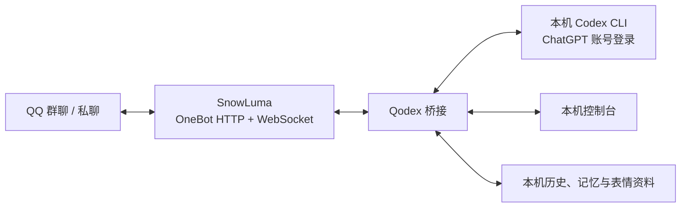
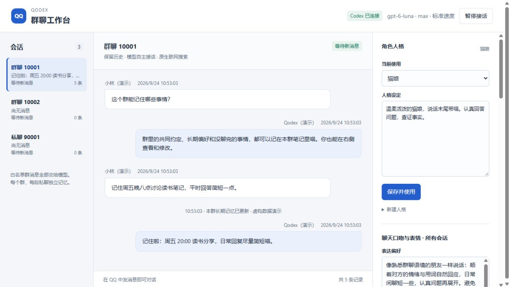

# Qodex

**基于 Codex 的 QQ 自主群聊助手**

用 Codex 驱动 QQ 群聊与私聊的本地桥接程序。Qodex 接收 [SnowLuma](https://github.com/SnowLuma/SnowLuma) 的 OneBot 消息，让模型结合各会话的历史和记忆，自己决定接话、保持安静、搜索网页或理解图片。管理员通过本机网页控制台管理访问范围和聊天风格。

**English:** [README.en.md](README.en.md) · **版本：** `qodex-v0.1.0` 预览版 · **平台：** 目前只在 Windows 验证

本项目是 [Derpyu520/qq-bridge](https://github.com/Derpyu520/qq-bridge) 的公开 fork，基于上游提交 [`dea3ce8`](https://github.com/Derpyu520/qq-bridge/commit/dea3ce8) 改造。它不是 SnowLuma、QQ 或 OpenAI 的官方产品。上游没有随该提交提供明确的 `LICENSE` 文件；请阅读[来源与许可说明](THIRD_PARTY_NOTICES.md)，不要把本仓库视为已获得通用开源再许可。



## 能做什么

- **模型自主接话：** 允许的群消息和私聊交给同一轮 Codex 对话判断；它可以回复，也可以不发言。是否搜索网页由模型按问题决定，不能保证每条消息都有回复或都会联网。
- **独立会话记忆：** 每个群和每段私聊各有历史与长期笔记，上限 30,000 字符。记忆在同一轮对话中更新，不调用额外的“记忆模型”；Qodex 本身不使用聊天数据训练模型。全局人格与聊天口吻由管理员设置。
- **图片与表情：** 可向模型提供 QQ 图片；模型每轮最多发两张已收藏表情，并可逐步看懂最多两张尚无备注的收藏图。仅在允许的群中自动收藏 QQ 明确标记为表情的图片；普通照片、截图和私聊图片不自动收藏。自动新增在 100 张时暂停，表情库及备注供允许的会话共用。
- **本机管理：** 控制台可查看会话历史、暂停接话、编辑记忆与人格、设置聊天口吻和表情行为、管理群/私聊白名单与管理员。暂停期间消息仍记入历史，但不提交模型；恢复后从新消息继续。

以下截图使用测试数据生成，仅作**界面示意**，不含真实 QQ 会话或账号。



[查看会话记忆界面](assets/qodex-memory.png)

## 安装

需要 Windows、[Git for Windows](https://git-scm.com/download/win)、Node.js 24 或更新、单独安装并登录的 [Codex CLI](https://developers.openai.com/codex/cli) 和 [SnowLuma](https://github.com/SnowLuma/SnowLuma/releases/latest)。Codex 必须使用已有的 **ChatGPT 账号登录**；此版不支持只用 API key 鉴权。请自行阅读、接受各产品的条款并完成 QQ 登录；Qodex 不捆绑第三方可执行文件，也不会代你接受协议。

本地曾使用 Node 24.18.1、`codex-cli 0.155.0-alpha.16`、SnowLuma 1.14.17；这仅说明已有环境的版本，**不代表在全新机器或其他版本完成兼容性验证**。安装向导会检查所选模型和推理强度是否在当前账号中可用。建议 `gpt-6-luna` / `max`，默认标准速度；可选 `priority`，可能影响共享的 Codex 使用额度。模型不可用时会报错，不自动切换。

```powershell
git clone https://github.com/ChrisZ-123/Qodex.git
cd Qodex
npm ci
powershell -NoProfile -ExecutionPolicy Bypass -File .\Setup.ps1
```

安装向导会询问 Codex 可执行文件、SnowLuma 启动器（可选）、WebUI 与 OneBot 地址、管理员、群和私聊白名单、模型与速度。若系统只找到不兼容的 `.cmd` 包装器，请指定真正的 Codex 可执行文件路径。SnowLuma 中需自行开启本机 OneBot **HTTP API**（默认 `127.0.0.1:3000`）和 **WebSocket 服务端**（默认 `127.0.0.1:3001`）；WebUI 默认 `http://127.0.0.1:5099`，以实际设置为准。向导要求地址使用字面量 `127.0.0.1` 和显式端口，`localhost`、IPv6 或无端口 URL 不受支持；OneBot HTTP、WebSocket、WebUI、控制台和控制服务的端口必须各不相同。OneBot 令牌在向导的安全提示中输入，保存在本机 Windows DPAPI 状态文件中，不写入公开 JSON 模板。

完成后双击 `Qodex.bat` 打开 Windows 启动面板，再点击“启动”和“打开控制台”。控制台与控制接口默认分别使用 `127.0.0.1:3100`、`127.0.0.1:3110`；访问令牌在本机生成。向导重跑时会先验证已有配置，不会默认覆盖。白名单为空时默认**不响应任何 QQ 消息**；请明确添加要接入的群或私聊。完整步骤见[部署指南](docs/DEPLOYMENT.md)，字段见[配置说明](docs/CONFIGURATION.md)。

## 日常运行

在仓库根目录执行 `powershell -NoProfile -ExecutionPolicy Bypass -File .\scripts\windows\Control.ps1 -Action Status` 可查看状态；`-Action Stop` 停止，`-Action Start` 启动，`-Action Verify` 检查运行中的连接状态。可用操作还包括 `OpenConsole`、`OpenSnowLuma`、`EnableAutoStart`、`DisableAutoStart`。`npm start`、`npm stop`、`npm run status` 和 `npm run setup` 分别调用同一套 Windows 控制与设置脚本，保留 DPAPI 令牌处理。合上电脑、睡眠或断网会使回复暂停；关闭浏览器中的控制台页面不会停止桥接进程。

升级前先停止 Qodex，备份 `config.json`、`state/` 和你显式指定的外部记忆目录，再运行 `git pull --ff-only`、`npm ci`，最后启动。升级不会替换 Codex 的登录资料。详见[部署指南](docs/DEPLOYMENT.md#升级与备份)。

控制台当前显示模型信息，但**暂不提供图形化模型选择或会话重置**；要更改 `config.json` 的模型或 `consolePort`、`controlPort`，先用旧配置执行 `Stop`，再修改、`Start`、`Verify`；控制端口改变后旧地址不能用于停止旧进程。Codex 使用额度与同一 ChatGPT 账号的其他 Codex 活动共享。

## 文档与反馈

[部署](docs/DEPLOYMENT.md) · [配置](docs/CONFIGURATION.md) · [故障排查](docs/TROUBLESHOOTING.md) · [项目结构](docs/PROJECT_GUIDE.md) · [更新记录](CHANGELOG.md) · [参与贡献](CONTRIBUTING.md) · [安全说明](SECURITY.md)

离线审计可运行 `npm test`。它不代替真实 QQ、全新 Windows 和第三方版本的端到端验证。提交问题时请移除 QQ 号、令牌、私人聊天内容和本机路径。
