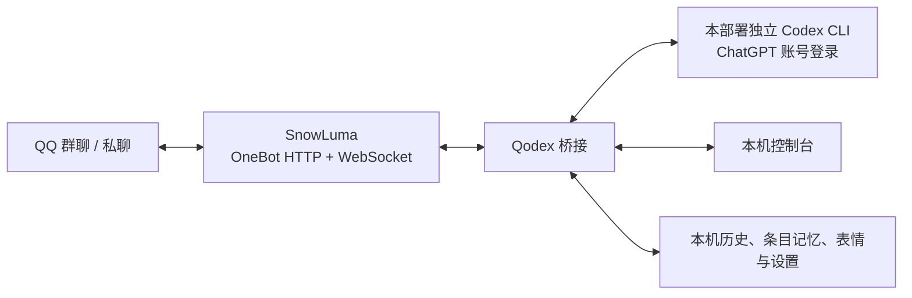
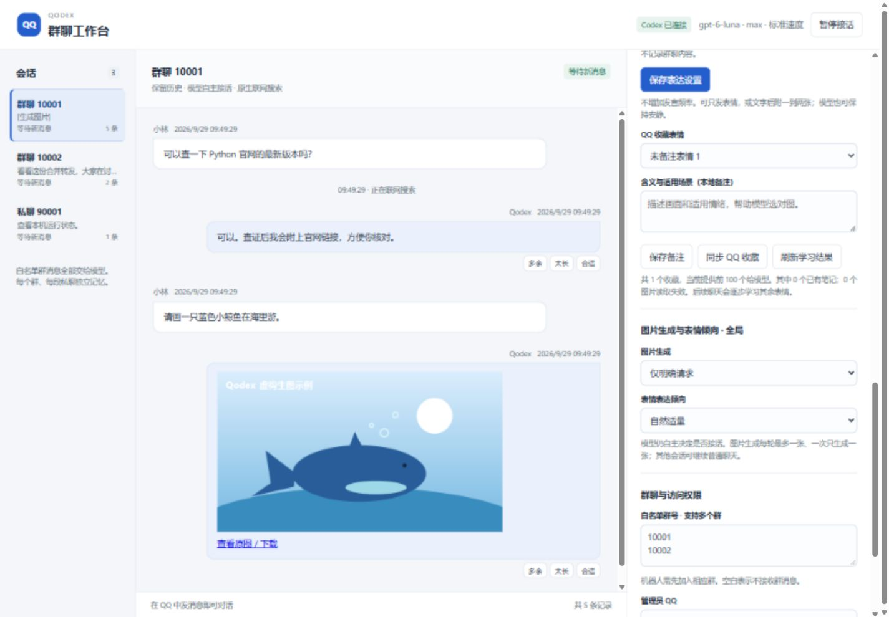

# Qodex

**基于 Codex 的 QQ 自主群聊助手**

用 Codex 驱动 QQ 群聊与私聊的本地桥接程序。Qodex 接收 [SnowLuma](https://github.com/SnowLuma/SnowLuma) 的 OneBot 消息，让模型结合各会话的历史和记忆，自己决定接话、保持安静、搜索网页或理解图片。管理员通过本机网页控制台管理访问范围和聊天风格。

**English:** [README.en.md](README.en.md) · **版本：** `qodex-v0.4.0` 预览版 · **平台：** 目前只在 Windows 验证

本项目是 [Derpyu520/qq-bridge](https://github.com/Derpyu520/qq-bridge) 的公开 fork，基于上游提交 [`dea3ce8`](https://github.com/Derpyu520/qq-bridge/commit/dea3ce8) 改造。它不是 SnowLuma、QQ 或 OpenAI 的官方产品。上游没有随该提交提供明确的 `LICENSE` 文件；请阅读[来源与许可说明](THIRD_PARTY_NOTICES.md)，不要把本仓库视为已获得通用开源再许可。


```mermaid
flowchart LR
    QQ[QQ 群聊 / 私聊] <--> SL[SnowLuma<br/>OneBot HTTP + WebSocket]
    SL <--> QB[Qodex 桥接]
    QB <--> CX[本部署独立 Codex CLI<br/>ChatGPT 账号登录]
    QB <--> UI[本机控制台]
    QB <--> ST[本机历史、条目记忆、表情与设置]
```

## 能做什么

- **模型自主接话：** 允许的群消息和私聊交给同一轮 Codex 对话判断；它可以回复，也可以不发言。是否搜索网页由模型按问题决定，不能保证每条消息都有回复或都会联网。
- **独立会话与设置：** 每个群和私聊分别保留模型上下文及历史。模型、推理强度、人格和聊天口吻可继承全局设置，也可按会话覆盖；还能为单个会话暂停、取消当前回复或重置上下文。全局速度及自动压缩阈值对所有会话生效。
- **条目记忆与表达反馈：** 每个会话的长期记忆独立保存，总有效内容上限 30,000 字符；支持来源、修订、置顶、停用和旧版恢复。本轮按需检索相关条目，模型可在同轮逐条更新。机器人回复可标记“多余”“太长”或“合适”，并可撤销反馈。这些只是本地资料和表达提示，**不是模型训练**。
- **原生生图与改图：** 群友可请求新图，或引用本会话图片要求改图；每轮最多发送一张。公开安装默认“仅明确请求”，可改为关闭或允许模型主动生成。生图全局串行，其他群仍能文字聊天；失败或取消不自动重试。图片存于本部署 `state/generated-images`，备份 JSON 只含元数据。
- **合并转发与自然接话：** 可读取当前消息或本会话引用的合并转发，向模型提供转发文字和图片；控制台展示内容、读取耗时与截断提示。无 @ 的开放话题也可参与，模型仍会选择安静；旧转发中的命令没有管理权限。
- **收藏表情：** 模型每轮最多发两张已收藏表情，并可逐步看懂最多两张尚无备注的收藏图。仅在允许的群中自动收藏 QQ 明确标记为表情的图片；普通照片、截图和私聊图片不自动收藏。自动新增在 100 张时暂停。图库支持搜索、学习状态筛选、备注及全局或分会话禁用；禁用不会删除 QQ 收藏。公开默认“自然适量”。
- **本机管理与备份：** 控制台可查看分会话运行阶段、排队、搜索耗时、发送结果及脱敏错误；管理权限、暂停、人格、历史、记忆与表情。可导出白名单格式 JSON，预览差异并选择恢复。备份可选带历史，不导出本机凭据文件、登录态或图片本体；私人文本仍需自行保管。

以下截图使用测试数据生成，仅作**界面示意**，不含真实 QQ 会话或账号。



[控制台总览](assets/qodex-console-v030.png) · [条目记忆](assets/qodex-memory-v030.png) · [表情图库](assets/qodex-gallery-v030.png) · [备份恢复](assets/qodex-backup-v030.png) · [v0.4 转发与运行记录](assets/qodex-features-v040.jpg)

## 安装

需要 Windows、[Git for Windows](https://git-scm.com/download/win)、Node.js 24 或更新、单独安装的 [Codex CLI](https://developers.openai.com/codex/cli) 和 [SnowLuma](https://github.com/SnowLuma/SnowLuma/releases/latest)。Codex 必须使用 **ChatGPT 账号**为这个部署单独完成官方登录；此版不支持只用 API key 鉴权。请自行阅读、接受各产品的条款并完成 QQ 登录；Qodex 不捆绑第三方可执行文件，也不会代你接受协议。

首次预览版记录的本机环境为 Node 24.18.1、`codex-cli 0.155.0-alpha.16`、SnowLuma 1.14.17；这是历史记录，**不是 v0.4.0 的全版本兼容保证**。安装向导检查独立登录账号可用的模型和推理强度。建议 `gpt-6-luna` / `max`，默认标准速度；可选 `priority` 加速，**不保证固定倍率提速**，且可能影响共享的 Codex 使用额度。主动生图也会增加用量。模型不可用时会报错，不自动切换。

```powershell
git clone https://github.com/ChrisZ-123/Qodex.git
cd Qodex
npm ci
powershell -NoProfile -ExecutionPolicy Bypass -File .\scripts\windows\Login-Codex.ps1
powershell -NoProfile -ExecutionPolicy Bypass -File .\Setup.ps1
```

独立登录由 Codex 官方命令完成，状态保存在本部署的 `state/codex-home`；Qodex 不复制桌面端登录资料。登录后再运行安装向导。控制台可调整全局和分会话的图片生成、表情倾向；现有已保存值不会被升级覆盖。

安装向导会询问 Codex 可执行文件、SnowLuma 启动器（可选）、WebUI 与 OneBot 地址、管理员、群和私聊白名单、模型与速度。若系统只找到不兼容的 `.cmd` 包装器，请指定真正的 Codex 可执行文件路径。SnowLuma 中需自行开启本机 OneBot **HTTP API**（默认 `127.0.0.1:3000`）和 **WebSocket 服务端**（默认 `127.0.0.1:3001`）；WebUI 默认 `http://127.0.0.1:5099`，以实际设置为准。向导要求地址使用字面量 `127.0.0.1` 和显式端口，`localhost`、IPv6 或无端口 URL 不受支持；OneBot HTTP、WebSocket、WebUI、控制台和控制服务的端口必须各不相同。OneBot 令牌在向导的安全提示中输入，保存在本机 Windows DPAPI 状态文件中，不写入公开 JSON 模板。

完成后双击 `Qodex.bat` 打开 Windows 启动面板，再点击“启动”和“打开控制台”。控制台与控制接口默认分别使用 `127.0.0.1:3100`、`127.0.0.1:3110`；访问令牌在本机生成。向导重跑时会先验证已有配置，不会默认覆盖。白名单为空时默认**不响应任何 QQ 消息**；请明确添加要接入的群或私聊。完整步骤见[部署指南](docs/DEPLOYMENT.md)，字段见[配置说明](docs/CONFIGURATION.md)。

## 日常运行

在仓库根目录执行 `powershell -NoProfile -ExecutionPolicy Bypass -File .\scripts\windows\Control.ps1 -Action Status` 可查看状态；`-Action Stop` 停止，`-Action Start` 启动，`-Action Verify` 检查运行中的连接状态。可用操作还包括 `OpenConsole`、`OpenSnowLuma`、`EnableAutoStart`、`DisableAutoStart`。`npm start`、`npm stop`、`npm run status` 和 `npm run setup` 分别调用同一套 Windows 控制与设置脚本，保留 DPAPI 令牌处理。合上电脑、睡眠或断网会使回复暂停；关闭浏览器中的控制台页面不会停止桥接进程。

从 v0.3.0 升级前先停止 Qodex，完整备份源码、`config.json`、整个 `state/`、自定义角色及外部记忆目录。升级后单独登录，可选择迁移旧原生 Codex 会话；也可明确从新模型上下文开始，桥接历史与记忆仍保留。按[v0.4.0 升级与回退指南](docs/UPGRADE_V040.md)检查后再启动。旧版 v0.2.0 用户先参照[v0.3.0 升级指南](docs/UPGRADE_V030.md)处理记忆格式。

控制台的**全局模型与推理强度**供默认继承；某个会话可单独选择自己的组合。保存后从下一轮生效，正在处理的回复沿用本轮启动时设置；设置若被其他操作更新，会提示刷新后重试。全局速度与自动压缩阈值作用于所有会话，留空阈值使用 Codex 模型默认值。**重置当前对话上下文**会取消该会话待发送回复，保留历史、人格和长期记忆；下一条消息创建新会话，不重新注入重置前的历史。已发送到 QQ 的消息不会撤回。

修改本机 `consolePort`、`controlPort` 前仍须先用旧配置执行 `Stop`，再修改、`Start`、`Verify`。Codex 使用额度与同一 ChatGPT 账号的其他 Codex 活动共享。

## 文档与反馈

[部署](docs/DEPLOYMENT.md) · [v0.4.0 升级与回退](docs/UPGRADE_V040.md) · [配置](docs/CONFIGURATION.md) · [控制台接口](docs/CONSOLE_API.md) · [故障排查](docs/TROUBLESHOOTING.md) · [项目结构](docs/PROJECT_GUIDE.md) · [更新记录](CHANGELOG.md) · [参与贡献](CONTRIBUTING.md) · [安全说明](SECURITY.md)

离线审计可运行 `npm test`。它不代替真实 QQ、全新 Windows 和第三方版本的端到端验证。提交问题时请移除 QQ 号、令牌、私人聊天内容和本机路径。
