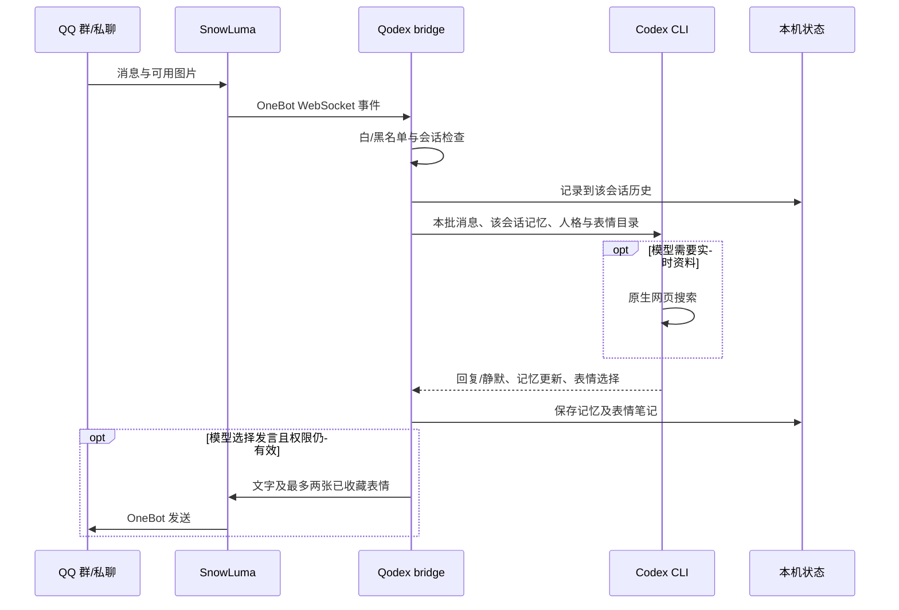

# 项目指南

Qodex `qodex-v0.2.0` 是基于 [Derpyu520/qq-bridge 提交 dea3ce8](https://github.com/Derpyu520/qq-bridge/commit/dea3ce8) 的公开预览 fork。当前受支持的发布路径是 **Windows + SnowLuma OneBot + Codex ChatGPT 登录 + `conversationMode: model`**。源码中保留了一些 DSH 时代的内部模块和脚本，供改造过程参考；这些不是本版安装所需或受支持的后端接口。不要运行旧 `setup-dsh.mjs` 作为 Qodex 安装步骤。

## 消息路径

每个 `group:<id>` 或 `private:<id>` 有独立 Codex 会话、历史和最多 30,000 字符的长期笔记。新增消息排入该会话的下一轮；本轮由同一个聊天模型决定是否发言及是否更新记忆，没有额外判断或记忆模型。群与私聊的长期笔记互不读取；管理员选择的人格、口吻和已收藏表情库是全局共享的。模型回复和搜索都不保证发生。Codex 使用同一 ChatGPT 账号的共享额度。

QQ 图片可作为当前消息输入。表情学习只会读取本轮实际附上的、尚无本地备注的收藏目录图，每轮最多两张。自动收藏仅处理白名单群中 OneBot 标为表情的图片；普通群图和私聊图不自动收藏。达到 100 张停止自动新增，既有收藏不会自动删除。模型每轮最多选择两张目录内的表情发送，表情笔记供允许的会话共用，但不应包含群友隐私。

## 主要文件

| 路径 | 作用 |
| --- | --- |
| `src/bridge.js` | OneBot 连接、白名单、消息处理、本机控制台与旧模块的入口。 |
| `src/codex-client.js` / `src/codex-rpc.js` | 启动隔离的 Codex app-server，会话、模型检查及事件转换。 |
| `src/model-chat.js` | 每会话队列、接话/静默、历史、暂停、发送与同轮记忆处理。 |
| `src/chat-memory.js` | 每会话记忆存取与 30,000 字符限制。 |
| `src/sticker-collector.js` / `src/sticker-learning.js` / `src/sticker-lib.js` | 表情自动收藏、看图笔记和目录管理。 |
| `public/model-console.html` | 当前模型对话控制台；支持模型/推理强度选择和当前会话上下文重置。 |
| `scripts/windows/` | 安装、启动、状态、验证、停止和可选自动启动。 |
| `config.example.json` | 脱敏配置模板。真实 `config.json`、`state/` 不提交。 |

Codex 子进程使用本地 ChatGPT 登录，启动时检查 `account/read`、`model/list` 与所选推理强度，创建会话时禁止模型回退。发布模式下不向 Codex 暴露 QQ MCP 发送工具；QQ 发送由桥接在检查当前权限和暂停状态后执行。进程级配置关闭 shell、插件、连接器、计算机操作和多智能体能力，并使用只读沙箱；原生网页搜索仍可使用。实际安全边界应结合代码与本机配置审阅，控制台/OneBot 服务只绑定本机回环地址。

## 本地数据与验证

`state/` 包含会话映射、聊天历史、表情资料、DPAPI 令牌状态和日志。`chatMemory.directory` 默认是仓库根目录下的 `state/chat-memory`；显式相对路径也从仓库根目录解析，绝对路径按原值使用。迁移或升级前须备份 `config.json`、`state/` 及任何仓库外的记忆目录。Codex 官方登录资料不在 Qodex 仓库里。

变更后先运行聚焦检查；发布回归入口是 `npm test`，Windows 部署脚本检查是 `npm run test:deployment`。这些检查不代替新机器、真实 QQ 和第三方版本的联调。贡献前参阅[贡献指南](../CONTRIBUTING.md)、[安全说明](../SECURITY.md)与[来源及许可说明](../THIRD_PARTY_NOTICES.md)。
